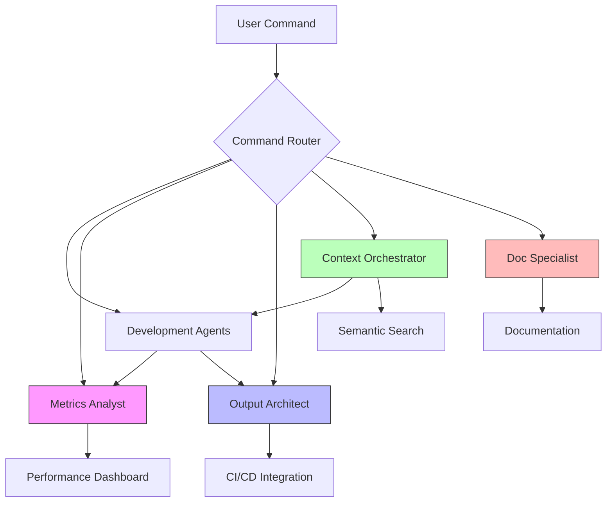

# Context Engineering Agents for SuperClaude

## 概要

このディレクトリには、SuperClaudeフレームワークのコンテキストエンジニアリング機能を実装する4つの新エージェントが含まれています。

## 🎯 Context Engineering とは?

Context Engineeringは、LLMエージェントのコンテキストウィンドウを最適に管理するための技術です。主に4つの戦略があります:

1. **Write Context** (書き込み) - コンテキストを外部に永続化
2. **Select Context** (選択) - 必要なコンテキストを取得
3. **Compress Context** (圧縮) - トークンを最適化
4. **Isolate Context** (分離) - コンテキストを分割管理

## 📊 実装状況

| エージェント | ステータス | 仕様 | 実装 | テスト |
|------------|----------|------|------|--------|
| **Metrics Analyst** | ✅ 完了 | ✅ | ✅ | 🔄 |
| **Output Architect** | ✅ 完了 | ✅ | 🔄 | ⏳ |
| **Context Orchestrator** | ✅ 完了 | ✅ | 🔄 | ⏳ |
| **Documentation Specialist** | ✅ 完了 | ✅ | 🔄 | ⏳ |

## 🤖 エージェント詳細

### 1. Metrics Analyst (メトリクスアナリスト)

**役割**: パフォーマンス評価と最適化

**主な機能**:
- リアルタイムメトリクス収集
- パフォーマンスダッシュボード
- A/Bテストフレームワーク
- 最適化推奨

**Context Engineering 適用**:
- ✍️ Write: SQLiteにメトリクス永続化
- 🗜️ Compress: トークン使用量追跡・最適化

**アクティベーション**:
```bash
/sc:metrics session
/sc:metrics week --optimize
```

**ファイル**:
- 仕様: `metrics-analyst.md`
- 実装: `src/metrics_analyst.py`

### 2. Output Architect (出力アーキテクト)

**役割**: 構造化出力生成とバリデーション

**主な機能**:
- 複数フォーマット出力 (JSON, YAML, Markdown)
- スキーマ定義とバリデーション
- CI/CD統合サポート
- APIクライアントライブラリ

**Context Engineering 適用**:
- 🔒 Isolate: 構造化データを分離
- ✍️ Write: 出力スキーマを永続化

**グローバルフラグ**:
```bash
/sc:<command> --output-format json
/sc:<command> --output-format yaml
```

**ファイル**:
- 仕様: `output-architect.md`
- 実装: `src/output_architect.py` (実装中)

### 3. Context Orchestrator (コンテキストオーケストレーター)

**役割**: メモリ管理とRAG最適化

**主な機能**:
- ベクトルストア管理 (ChromaDB)
- セマンティック検索
- 動的コンテキスト注入
- ReActパターン実装

**Context Engineering 適用**:
- ✍️ Write: ベクトルDBに永続化
- 🔍 Select: セマンティック検索で取得
- 🗜️ Compress: トークン予算管理

**コマンド**:
```bash
/sc:memory index
/sc:memory search "authentication logic"
/sc:memory similar src/auth/handler.py
```

**ファイル**:
- 仕様: `context-orchestrator.md`
- 実装: `src/context_orchestrator.py` (実装中)

### 4. Documentation Specialist (ドキュメントスペシャリスト)

**役割**: 技術ドキュメント自動生成

**主な機能**:
- API ドキュメント生成
- README 自動作成
- チュートリアル生成
- 多言語サポート (en, ja, zh, ko)

**Context Engineering 適用**:
- ✍️ Write: ドキュメントを永続化
- 🔍 Select: コード例を取得
- 🗜️ Compress: 情報を要約

**コマンド**:
```bash
/sc:document generate
/sc:document api src/api/
/sc:document tutorial authentication
```

**ファイル**:
- 仕様: `documentation-specialist.md`
- 実装: `src/documentation_specialist.py` (実装中)

## 📈 成功指標

### 目標改善

| 指標 | 現在 | 目標 | 改善 |
|-----|------|------|------|
| **評価パイプライン** | 65% | 95% | +30% |
| **構造化出力** | 78% | 95% | +17% |
| **RAG統合** | 88% | 98% | +10% |
| **メモリ管理** | 85% | 95% | +10% |
| **総合コンプライアンス** | 83.7% | 95% | **+11.3%** |

## 🏗️ アーキテクチャ

```
SuperClaude Framework
│
├── Commands (既存)
│   ├── /sc:implement
│   ├── /sc:analyze
│   └── ...
│
├── Agents (既存)
│   ├── system-architect
│   ├── backend-engineer
│   └── ...
│
└── ContextEngineering (新規)
    │
    ├── 📊 Metrics Analyst
    │   ├── metrics-analyst.md
    │   └── src/metrics_analyst.py
    │
    ├── 🗂️ Output Architect
    │   ├── output-architect.md
    │   └── src/output_architect.py
    │
    ├── 🧠 Context Orchestrator
    │   ├── context-orchestrator.md
    │   └── src/context_orchestrator.py
    │
    └── 📚 Documentation Specialist
        ├── documentation-specialist.md
        └── src/documentation_specialist.py
```

## 🔗 エージェント連携



## 📋 インストール & セットアップ

### 依存関係

```bash
# 基本依存関係
pip install chromadb  # Context Orchestrator用
pip install openai    # 埋め込み生成用 (Context Orchestrator)
pip install pydantic  # スキーマ検証用 (Output Architect)
pip install pyyaml    # YAML出力用 (Output Architect)

# オプション (開発用)
pip install pytest pytest-cov  # テスト
pip install black mypy flake8  # コード品質
```

### 設定

```python
# ~/.claude/config.yaml
context_engineering:
  metrics_analyst:
    enabled: true
    db_path: ~/.claude/metrics/metrics.db
    
  output_architect:
    enabled: true
    default_format: human
    validate_output: true
    
  context_orchestrator:
    enabled: true
    vector_store_path: ~/.claude/vector_store/
    embedding_model: text-embedding-3-small
    
  documentation_specialist:
    enabled: true
    languages: [en, ja]
    auto_generate: false
```

## 🧪 テスト

```bash
# 全テスト実行
pytest tests/

# カバレッジ付き
pytest --cov=src --cov-report=html

# 特定エージェントのテスト
pytest tests/test_metrics_analyst.py
pytest tests/test_output_architect.py
pytest tests/test_context_orchestrator.py
pytest tests/test_documentation_specialist.py
```

## 📚 ドキュメント

- [Context Engineering 理論](../../Docs/context_engineering_theory.md)
- [エージェント設計原則](../../Docs/agent_design_principles.md)
- [API リファレンス](../../Docs/api_reference.md)

## 🤝 貢献

1. このディレクトリで作業
2. テストを書く
3. ドキュメントを更新
4. PRを作成

## 📝 ライセンス

MIT License - SuperClaude Framework

## 🔗 関連リンク

- [SuperClaude Framework](https://github.com/SuperClaude-Org/SuperClaude_Framework)
- [Context Engineering 論文](https://blog.langchain.com/context-engineering/)
- [LangGraph Documentation](https://langchain-ai.github.io/langgraph/)

---

**バージョン**: 1.0.0  
**ステータス**: 実装中  
**最終更新**: 2025-10-11
