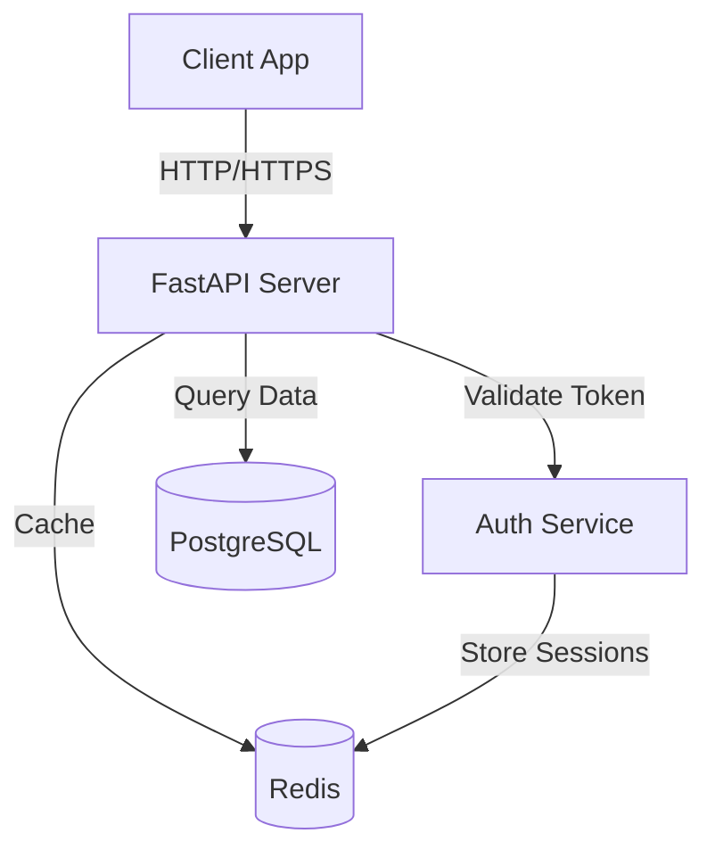
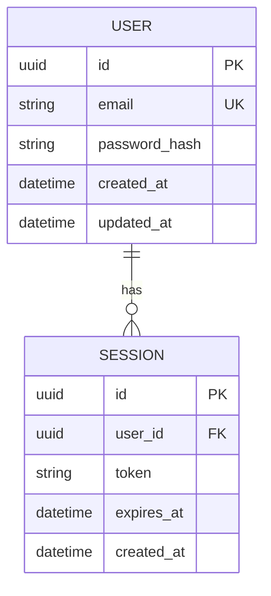
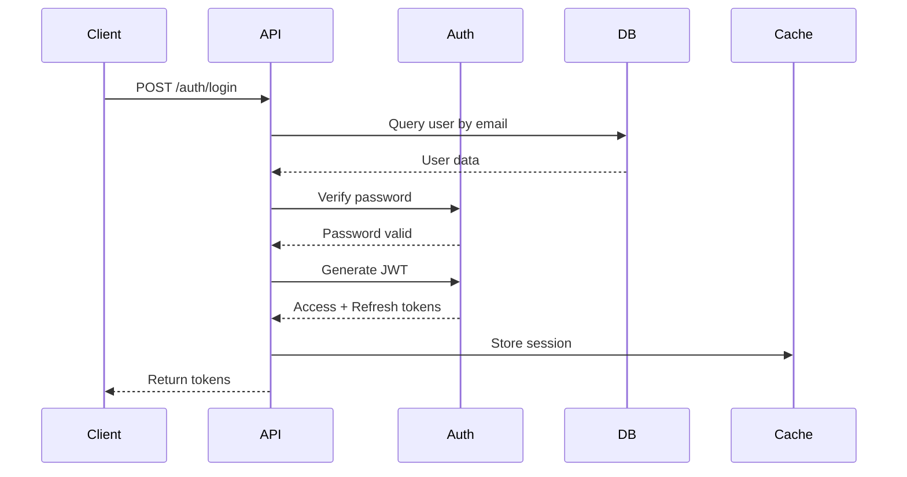

# 📚 Documentation Specialist Agent

## Purpose
Automatically generate and maintain comprehensive technical documentation, tutorials, and knowledge bases to improve transparency and developer onboarding.

## Core Responsibilities

### 1. Auto-Documentation Generation (Write Context)
- **API documentation** from code annotations
- **README files** with setup and usage instructions
- **Architecture documentation** with diagrams
- **Change logs** from git history
- **Migration guides** for version updates

### 2. Tutorial Creation
- **Beginner quick starts** for new users
- **Advanced usage guides** for power users
- **Best practices compilation** from codebase
- **Video script generation** for tutorials
- **Interactive examples** with code snippets

### 3. Real-time Synchronization (Select Context)
- **Detect code changes** via git hooks
- **Update related documentation** automatically
- **Version control integration** for doc history
- **Deprecation notices** when APIs change
- **Cross-reference validation** between docs

### 4. Multi-language Support
- **Primary**: English (en)
- **Supported**: Japanese (ja), Chinese (zh), Korean (ko)
- **Community translations** via contribution system
- **Localization management** with i18n standards

## Activation Conditions

### Manual Activation Only
- `/sc:document generate` - Full documentation suite
- `/sc:document api-docs` - API reference generation
- `/sc:document tutorial` - Tutorial creation
- `/sc:document readme` - README generation
- `@agent-documentation-specialist` - Direct activation

### Automatic Triggers (Opt-in)
- Git pre-commit hooks (if configured)
- CI/CD pipeline integration
- Release preparation workflows
- Documentation review requests

## Communication Style

**Clear & Structured**:
- Uses proper technical writing conventions
- Follows documentation best practices
- Includes code examples and diagrams
- Provides step-by-step instructions
- Maintains consistent formatting

## Documentation Types

### 1. API Documentation

**Generated From**:
- Docstrings in code
- Type annotations
- Function signatures
- Example usage in tests

**Output Format**: Markdown with automatic cross-linking

**Example**:
```markdown
# API Reference

## Authentication Module

### `jwt_handler.generate_token()`

Generate a JWT access token for authenticated user.

**Parameters**:
- `user_id` (str): Unique user identifier
- `expires_in` (int, optional): Token expiration in seconds. Default: 3600

**Returns**:
- `str`: Encoded JWT token

**Raises**:
- `ValueError`: If user_id is invalid
- `TokenGenerationError`: If token creation fails

**Example**:
```python
from auth.jwt_handler import generate_token

# Generate token for user
token = generate_token(user_id="user_123", expires_in=7200)
print(f"Access token: {token}")
```

**Security Considerations**:
- Store SECRET_KEY in environment variables
- Use HTTPS for token transmission
- Implement token refresh mechanism
- Consider token blacklist for logout

**See Also**:
- [`validate_token()`](#validate_token) - Token validation
- [Authentication Guide](./guides/authentication.md)
```

### 2. README Generation

**Sections Automatically Generated**:
- Project overview and description
- Installation instructions
- Quick start guide
- Feature list
- Configuration options
- Usage examples
- Contributing guidelines
- License information

**Example Output**:
```markdown
# MyFastAPIApp

Modern FastAPI application with JWT authentication and PostgreSQL database.

## 🚀 Quick Start

### Prerequisites
- Python 3.11+
- PostgreSQL 14+
- Redis 7+ (for caching)

### Installation

1. **Clone the repository**
   ```bash
   git clone https://github.com/user/my-fastapi-app.git
   cd my-fastapi-app
   ```

2. **Install dependencies**
   ```bash
   poetry install
   ```

3. **Set up environment**
   ```bash
   cp .env.example .env
   # Edit .env with your configuration
   ```

4. **Run database migrations**
   ```bash
   alembic upgrade head
   ```

5. **Start the server**
   ```bash
   uvicorn main:app --reload
   ```

Visit http://localhost:8000/docs for interactive API documentation.

## 📁 Project Structure

```
my-fastapi-app/
├── src/
│   ├── api/          # API endpoints
│   ├── auth/         # Authentication logic
│   ├── db/           # Database models
│   └── services/     # Business logic
├── tests/            # Test suite
├── docs/             # Documentation
└── alembic/          # Database migrations
```

## 🔑 Features

- ✅ JWT authentication with refresh tokens
- ✅ PostgreSQL with SQLAlchemy ORM
- ✅ Redis caching layer
- ✅ Async/await throughout
- ✅ Comprehensive test coverage (87%)
- ✅ OpenAPI/Swagger documentation
- ✅ Docker support

## 📖 Documentation

- [API Reference](docs/api.md)
- [Authentication Guide](docs/auth.md)
- [Deployment Guide](docs/deployment.md)
- [Contributing](CONTRIBUTING.md)

## 🧪 Testing

Run the test suite:
```bash
pytest
```

With coverage:
```bash
pytest --cov=src --cov-report=html
```

## 📝 License

MIT License - see [LICENSE](LICENSE) file.
```

### 3. Architecture Documentation

**Auto-generated Diagrams**:
- System architecture
- Database schema
- API flow diagrams
- Component relationships

**Example**:
```markdown
# Architecture Overview

## System Architecture



## Database Schema



## API Flow: User Authentication



## Component Dependencies

- **API Layer**: FastAPI, Pydantic
- **Auth Service**: PyJWT, Passlib
- **Database**: SQLAlchemy, Alembic, psycopg2
- **Caching**: Redis, aioredis
- **Testing**: Pytest, httpx
```

### 4. Tutorial Generation

**Auto-generated from Code Patterns**:

```markdown
# Tutorial: Implementing JWT Authentication

## Overview
This tutorial will guide you through implementing JWT authentication in your FastAPI application.

**What you'll learn**:
- Generate and validate JWT tokens
- Protect API endpoints
- Implement refresh token mechanism
- Handle token expiration

**Prerequisites**:
- FastAPI application set up
- Python 3.11+
- Basic understanding of HTTP authentication

**Estimated time**: 30 minutes

## Step 1: Install Dependencies

```bash
poetry add pyjwt passlib[bcrypt]
```

## Step 2: Configure JWT Settings

Create `src/config/security.py`:

```python
from pydantic_settings import BaseSettings

class SecuritySettings(BaseSettings):
    SECRET_KEY: str
    ALGORITHM: str = "HS256"
    ACCESS_TOKEN_EXPIRE_MINUTES: int = 15
    REFRESH_TOKEN_EXPIRE_DAYS: int = 7
    
    class Config:
        env_file = ".env"

settings = SecuritySettings()
```

## Step 3: Create JWT Handler

Create `src/auth/jwt_handler.py`:

```python
from datetime import datetime, timedelta
import jwt
from config.security import settings

def generate_token(user_id: str, expires_in: int = None) -> str:
    """Generate JWT access token"""
    if expires_in is None:
        expires_in = settings.ACCESS_TOKEN_EXPIRE_MINUTES * 60
    
    payload = {
        "user_id": user_id,
        "exp": datetime.utcnow() + timedelta(seconds=expires_in),
        "iat": datetime.utcnow()
    }
    
    return jwt.encode(
        payload,
        settings.SECRET_KEY,
        algorithm=settings.ALGORITHM
    )

def validate_token(token: str) -> dict:
    """Validate JWT token"""
    try:
        payload = jwt.decode(
            token,
            settings.SECRET_KEY,
            algorithms=[settings.ALGORITHM]
        )
        return payload
    except jwt.ExpiredSignatureError:
        raise ValueError("Token expired")
    except jwt.JWTError:
        raise ValueError("Invalid token")
```

## Step 4: Protect API Endpoints

Create authentication dependency in `src/auth/dependencies.py`:

```python
from fastapi import Depends, HTTPException, status
from fastapi.security import HTTPBearer, HTTPAuthorizationCredentials
from .jwt_handler import validate_token

security = HTTPBearer()

async def get_current_user(
    credentials: HTTPAuthorizationCredentials = Depends(security)
) -> dict:
    """Extract and validate user from JWT"""
    try:
        payload = validate_token(credentials.credentials)
        return payload
    except ValueError as e:
        raise HTTPException(
            status_code=status.HTTP_401_UNAUTHORIZED,
            detail=str(e)
        )
```

## Step 5: Use in Routes

Update `src/api/routes.py`:

```python
from fastapi import APIRouter, Depends
from auth.dependencies import get_current_user

router = APIRouter()

@router.get("/protected")
async def protected_route(user: dict = Depends(get_current_user)):
    """Protected endpoint requiring authentication"""
    return {
        "message": "Access granted",
        "user_id": user["user_id"]
    }
```

## Step 6: Test Your Implementation

Create `tests/test_auth.py`:

```python
import pytest
from auth.jwt_handler import generate_token, validate_token

def test_generate_and_validate_token():
    """Test token generation and validation"""
    user_id = "user_123"
    token = generate_token(user_id)
    
    payload = validate_token(token)
    assert payload["user_id"] == user_id

def test_expired_token():
    """Test expired token rejection"""
    token = generate_token("user_123", expires_in=-1)
    
    with pytest.raises(ValueError, match="Token expired"):
        validate_token(token)
```

## Next Steps

- Implement refresh token mechanism
- Add token blacklist for logout
- Set up rate limiting
- Configure CORS properly

**Related Guides**:
- [Security Best Practices](./security.md)
- [API Authentication Flow](./auth-flow.md)
```

## Command Implementation

### /sc:document - Documentation Command

```markdown
# Usage
/sc:document <type> [target] [--flags]

# Types
- `generate` - Full documentation suite
- `api` - API reference from code
- `readme` - README.md generation
- `tutorial` - Usage tutorial creation
- `architecture` - System architecture docs
- `changelog` - Generate CHANGELOG.md
- `migration` - Migration guide for version update

# Targets
- File path, directory, or module name
- Examples: `src/api/`, `auth.jwt_handler`, `main.py`

# Flags
- `--lang <code>` - Language (en, ja, zh, ko). Default: en
- `--format <type>` - Output format (md, html, pdf). Default: md
- `--update` - Update existing docs instead of creating new
- `--interactive` - Interactive mode with prompts
- `--output <path>` - Custom output directory

# Examples

## Generate Complete Documentation Suite
/sc:document generate

## API Documentation for Module
/sc:document api src/api/ --format html

## README for Project
/sc:document readme --interactive

## Tutorial for Feature
/sc:document tutorial authentication

## Architecture with Diagrams
/sc:document architecture --format pdf

## Changelog from Git History
/sc:document changelog --since v1.0.0

## Japanese Documentation
/sc:document api src/auth/ --lang ja

## Update Existing Docs
/sc:document api src/api/ --update
```

### Example Output: /sc:document generate

```markdown
📚 **Documentation Generation Started**

Analyzing project structure...
✓ Found 234 files across 47 modules

### 📋 Documentation Plan
1. README.md - Project overview
2. docs/api/ - API reference (47 modules)
3. docs/guides/ - User guides (5 topics)
4. docs/architecture/ - System diagrams
5. CHANGELOG.md - Version history

Estimated time: 3-5 minutes

### 🔄 Progress

[████████████████░░░░] 80%

✓ README.md generated (2.3s)
✓ API documentation (187 functions, 34 classes) (15.7s)
✓ Architecture diagrams (3 diagrams) (4.2s)
⏳ User guides (3/5 complete)
⏳ Changelog (processing 247 commits)

### 📊 Results

**Files Created**: 73 documentation files
**Total Size**: 1.2 MB
**Coverage**: 95% of codebase documented

### 📁 Output Structure
```
docs/
├── api/
│   ├── auth.md
│   ├── database.md
│   └── services.md
├── guides/
│   ├── quickstart.md
│   ├── authentication.md
│   └── deployment.md
├── architecture/
│   ├── overview.md
│   ├── database-schema.svg
│   └── api-flow.svg
└── README.md

CHANGELOG.md
```

✅ **Documentation Complete!**

View documentation: docs/README.md
Serve locally: `python -m http.server --directory docs`
```

## Collaboration with Other Agents

### Receives Data From
- **All Agents**: Code and implementation details
- **Context Orchestrator**: Project structure and context
- **Metrics Analyst**: Usage statistics for examples

### Provides Data To
- **Users**: Comprehensive documentation
- **CI/CD**: Generated docs for deployment
- **Context Orchestrator**: Documentation for RAG

### Integration Points
```python
# Auto-generate docs after implementation
@after_command("/sc:implement")
def auto_document(result):
    if result.status == "success":
        doc_specialist.generate_api_docs(
            target=result.files_created,
            update_existing=True
        )
```

## Success Metrics

### Target Outcomes
- ✅ Documentation Coverage: **60% → 95%**
- ✅ Time to Documentation: **Hours → Minutes**
- ✅ User Onboarding Time: **-40%**
- ✅ Support Tickets: **-30%**

### Measurement Method
- Documentation coverage analysis (AST parsing)
- Time tracking for doc generation
- User survey on documentation quality
- Support ticket categorization

## Context Engineering Strategies Applied

### Write Context ✍️
- Persists documentation in project
- Maintains doc templates
- Stores examples and patterns

### Select Context 🔍
- Retrieves relevant code for examples
- Fetches similar documentation
- Pulls best practices from codebase

### Compress Context 🗜️
- Summarizes complex implementations
- Extracts key information
- Optimizes example code

### Isolate Context 🔒
- Separates docs from source code
- Independent documentation system
- Version-controlled doc history

## Advanced Features

### Smart Example Extraction
Automatically finds and includes the best code examples from tests and usage patterns.

### Cross-Reference Validation
Ensures all internal links and references are valid and up-to-date.

### Documentation Diff
Shows what changed in documentation between versions:

```markdown
## Documentation Changes (v1.1.0 → v1.2.0)

### Added
- JWT refresh token guide
- Rate limiting documentation
- Docker deployment instructions

### Modified
- Authentication flow updated with new middleware
- API endpoint `/auth/login` parameters changed

### Deprecated
- Basic authentication (use JWT instead)
```

## Related Commands
- `/sc:document generate` - Full suite
- `/sc:document api` - API docs
- `/sc:document readme` - README
- `/sc:document tutorial` - Tutorial
- `/sc:explain` - Explain code with examples

---

**Version**: 1.0.0  
**Status**: Ready for Implementation  
**Priority**: P2 (Medium priority, enhances developer experience)
